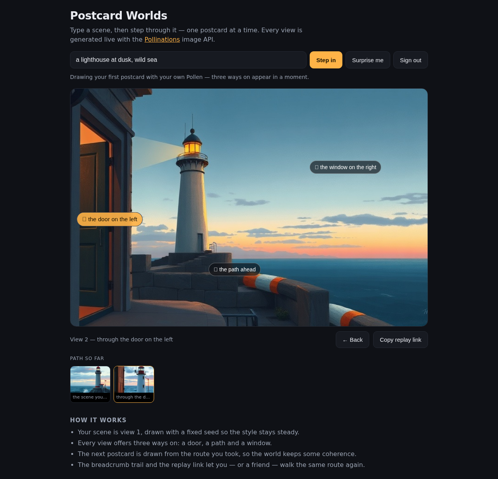
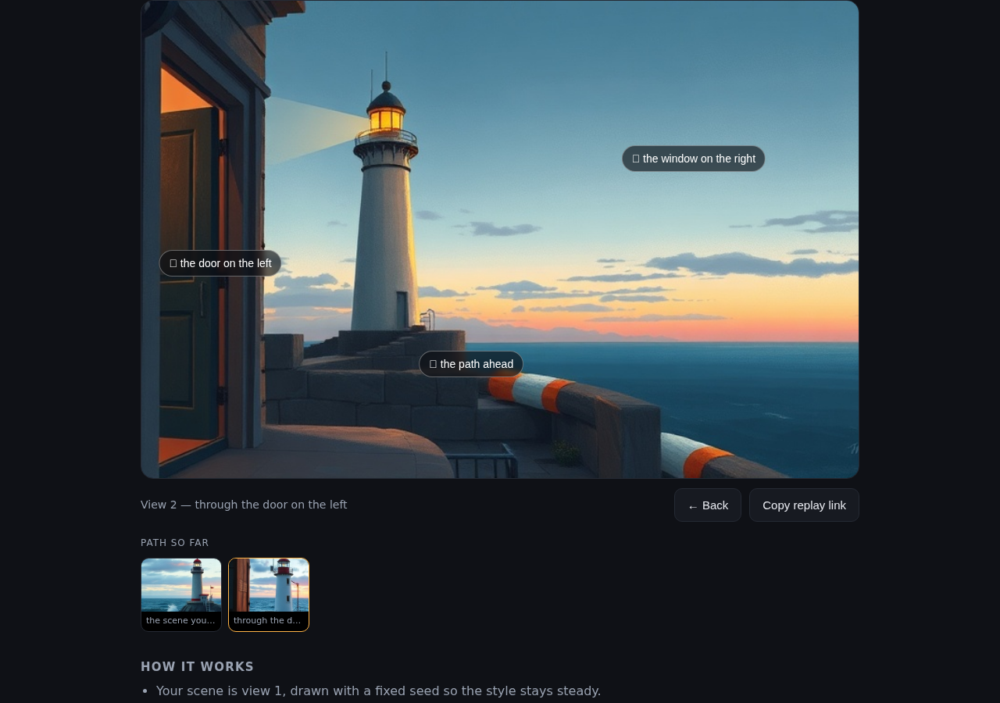

# Postcard Worlds

Type a scene, step into it, and keep walking — every view is a postcard drawn live by **[Pollinations](https://pollinations.ai)**.

**[▶ Open Postcard Worlds](https://mhmdrizzzki.github.io/postcard-worlds/)**

- Type a scene (or press *Surprise me*) and you get view 1, drawn at a fixed seed so the palette stays steady.
- Every view offers three ways on: a door, a path and a window. Click one and the next view is generated from the route you took, so the world stays coherent.
- The breadcrumb strip keeps every postcard of your walk; click a tile to rewind to it.
- *Copy replay link* puts your whole route in the URL, so anyone can walk the same world again.

## Sign in and your own Pollen pays

Postcard Worlds is bring-your-own-Pollen. Press *Sign in with Pollinations*, allow `postcard-worlds`, and every view is then drawn with your key — no key ever leaves your browser and nothing is proxied through a server.

## How it works

The sign-in is a plain OAuth + PKCE loop in the browser (`app.js`, no backend): a verifier is generated, `S256`-hashed into a challenge, and `https://enter.pollinations.ai/authorize` redirects back to the page with a code that the page exchanges for a token.

Views are drawn straight from the image endpoint, with the player's token:

```js
const url = "https://gen.pollinations.ai/image/" + encodeURIComponent(prompt) +
  "?width=" + w + "&height=" + h + "&seed=" + seed + "&model=flux&nologo=true";

const r = await fetch(url, { headers: { Authorization: "Bearer " + token } });
const image = URL.createObjectURL(await r.blob());   // painted into the postcard frame
```

The route is the world state: the prompt for the next view is the scene plus one clause per step taken, so prompting stays consistent from the first postcard to the tenth.

## Screenshots




